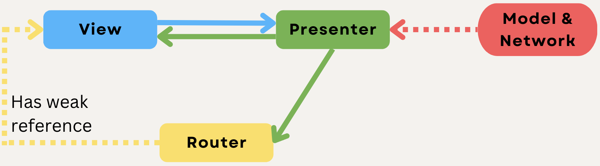

# FitnestX
FitnestX is a Application that combine workout app, meal tracker app and health app in one so that users will no longer need to use separate apps to keep.
Link design: https://www.pixeltrue.com/free-ui-kits/fitness-app-ui-kit

## Requirements

- iOS 12.0+
- Xcode 11+

## Installation:
CocoaPods will proceed on the assumption that it is installed on the terminal.
If you haven't installed it yet, please install it here.

```
$ cd /path/to/project

$ pod install
```
After all, Run in the simulator.

## Coding:
- MVP-R Pattern, have template to create it in project folder.
- Unit test for OnboardingPresenter, LoginPresenter and some Validator class.

## Todo:
- More screen.
- Use Dependency Injection.
- Use Firebase or database to do some function.
- Add Networking layer.

## Model View Presenter - Router (MVP-R) :heart:

<p align="center">
  
<p>

* `View` - delegates user interaction events to the `Presenter` and displays data passed by the `Presenter`
    * All `UIViewController`, `UIView`, `UITableViewCell` subclasses belong to the `View` layer
* `Presenter` - contains the presentation logic and tells the `View` what to present
    * Usually we have one `Presenter` per scene (view controller)
    * It doesn't reference the concrete type of the `View`, but rather it references the `View` protocol that is implemented usually by a `UIViewController` subclass
    * It should be a plain `Swift` class and not reference any `iOS` framework classes - this makes it easier to reuse it maybe in a `macOS` application
    * It should be covered by Unit Tests
* `Router` - contains navigation / flow logic from one scene (view controller) to another
    * In some communities / blog posts it might be referred to as a `FlowController`
    * It is usually referenced by the `Presenter` and weak referenced by the `View` (UIViewController)
